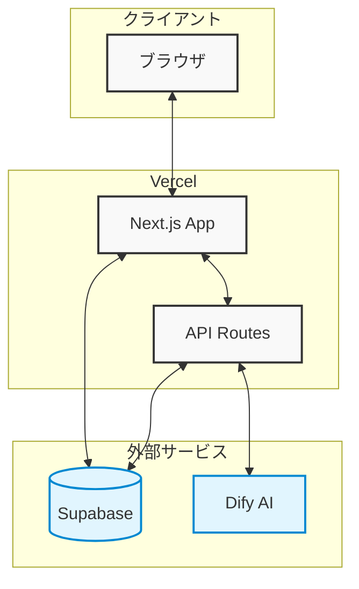

[](https://kosen-ai-chatbot.vercel.app/)

<h1 align="center">高専ChatBot</h1>

<p align="center">
  高専生の学習・学生生活を強力にサポートするAIチャットボット
</p>

<p align="center">
  <a href="#サービスの概要"><strong>サービスの概要</strong></a> ·
  <a href="#主な機能"><strong>主な機能</strong></a> ·
  <a href="#デモ"><strong>デモ</strong></a> ·
  <a href="#技術スタック"><strong>技術スタック</strong></a> ·
  <a href="#github-actionsによるsupabaseのsleep対策"><strong>GitHub ActionsによるSupabaseのSleep対策</strong></a> ·
  <a href="#vercelへのデプロイ"><strong>Vercelへのデプロイ</strong></a> 
</p>
<br/>

## サービスの概要

**高専ChatBot** は、高等専門学校 (高専) の学生生活を支援するために開発されたAIチャットボットです。専門科目の学習から実験レポートの作成、学生生活の相談まで、AIが24時間365日サポートを提供します。

月間トークン制限内で、学生はAIとの対話を通じて、日々の学習や課題解決を効率的に進めることができます。高専生活をより豊かに、より実りあるものにするための強力なパートナーとして、高専ChatBotをご活用ください。

### 開発の背景

高専生は一般の高校生と比べて専門的な学習内容が多く、また実験レポートの作成など独特の課題に直面します。しかし、これらの課題に対する支援リソースは限られており、特に放課後や休日のサポートが不足しているという課題がありました。

この課題を解決するため、AIを活用した24時間対応可能なチャットボットを開発しました。高専特有の専門用語や概念を理解し、学生の学習をきめ細かくサポートすることで、高専生の学習効率の向上と学生生活の充実を目指しています。

## 主な機能

- **AIチャット機能**: 自然言語による質問応答、専門知識の解説、レポート作成のアドバイスなど、多様なニーズに対応
- **ファイルアップロード**: 実験データやレポートのファイルをアップロードして、AIに分析やアドバイスを求めることが可能 (対応形式: txt, md, pdf, doc, docx, csv, jpg, jpeg, png, gif)
- **トークン使用量管理**: 月間のトークン使用量をプロフィールページで確認可能。計画的な利用をサポート (月間100,000トークンまで)
- **会話履歴**: 過去のチャット履歴を閲覧可能。いつでも以前の相談内容を振り返ることができます
- **ユーザー認証**: Supabaseによるセキュアなメールアドレス/パスワード認証機能
- **パスワード再設定**: パスワードを忘れた場合でも、メールアドレスによる再設定が可能
- **利用規約・プライバシーポリシー**: 利用規約とプライバシーポリシーを明記し、安心して利用できる環境を提供
- **レスポンシブデザイン**: PC、タブレット、スマートフォンなど、様々なデバイスで快適に利用可能 (Tailwind CSS利用)

## デモ

- **公開URL**: [https://kosen-ai-chatbot.vercel.app/](https://kosen-ai-chatbot.vercel.app/)

## 技術スタック

- **フロントエンド**:
    - Next.js (App Router) v14.x
    - TypeScript v5.x
    - Tailwind CSS v3.x
    - shadcn/ui (UIコンポーネント): Button, Card, Input, Label, Textarea, Checkbox, DropdownMenu, Badge, Progress
    - lucide-react: アイコン
    - react-markdown v9.x: Markdown表示
    - react-syntax-highlighter v15.x: コードハイライト
    - next-themes v0.4.x: ダークモード
- **バックエンド**:
    - Dify.ai: AIチャットAPI (Dify API v1)
    - Supabase: 認証 (Supabase Auth), データベース (Supabase Postgres)
- **ホスティング**:
    - Vercel
- **開発環境・ツール**:
    - Node.js v20.x
    - npm v10.x (package manager)
    - GitHub (リモートリポジトリ)
    - GitHub Actions (CI/CD, 定期Ping)
    - Cursor (開発エディタ)

## システム構成図



## GitHub ActionsによるSupabaseのSleep対策

Supabaseの無料プランでは、一定期間アクセスがないとデータベースがSleep状態になる場合があります。
本アプリでは、GitHub Actionsを利用して毎日1回、VercelでホストされているアプリのURLにPingを送信することで、Supabaseインスタンスが自動的にSleep状態になるのを防ぎます。

`.github/workflows/daily-ping.yaml`

```yaml
name: Prevent Supabase Sleep (Daily Ping)

on:
  schedule:
    # UTC 01:15 AM に実行 (JST 10:15 AM)
    - cron: "15 1 * * *"
  workflow_dispatch:

jobs:
  make_request:
    runs-on: ubuntu-latest
    env:
      TZ: "Asia/Tokyo"

    steps:
      - name: Send HTTP GET request
        run: |
          curl -X GET "https://kosen-ai-chatbot.vercel.app/" -v --fail || exit 1

      - name: Log request time
        run: |
          echo "Keep-alive ping completed at $(date)"
```

上記設定により、毎日UTC午前1時15分（JST午前10時15分）に `curl` コマンドが実行され、アプリのURLにGETリクエストが送信されます。
これにより、Supabaseデータベースへの定期的なアクセスが発生し、Sleep状態が回避されます。

**動作確認**:

GitHub Actionsの実行ログを確認することで、Pingが正常に送信されていることを確認できます。

1. GitHubリポジトリの `Actions` タブを選択
2. `Prevent Supabase Sleep (Daily Ping)` ワークフローを選択
3. 最新の実行ログ (`make_request` job) を確認


## Vercelへのデプロイ

本アプリケーションは、[Vercel platform](https://vercel.com/) を利用してデプロイ・公開しています。

**環境変数**:

Vercelへのデプロイ時に、以下の環境変数を設定する必要があります。

```
# Supabase
NEXT_PUBLIC_SUPABASE_URL=your-supabase-project-url
NEXT_PUBLIC_SUPABASE_ANON_KEY=your-supabase-anon-key
SUPABASE_SERVICE_ROLE_KEY=your-supabase-service-role-key

# Dify (サーバーサイドでのみ使用)
DIFY_API_KEY=your-dify-api-key
```

## 開発期間・体制

- **開発体制**: 個人開発
- **開発期間**: 2025.2 ~ 2025.2 (約6時間)

## 工夫した点・苦労した点

### 1. AIモデルの最適化
- Dify.aiのプロンプトエンジニアリングによる応答品質の向上
- 高専特有の専門用語や概念に対する理解度の改善
- コンテキスト管理による自然な会話の実現

### 2. セキュリティとプライバシー
- Supabaseのセキュリティ機能を活用したデータ保護
- トークン使用量の制限と監視機能の実装
- 個人情報の適切な取り扱いとプライバシー保護

### 3. ユーザビリティの向上
- 直感的なUIデザインの実現
- レスポンスタイムの最適化
- エラー時の適切なフィードバック提供

### 4. 技術的なチャレンジ
- Next.js 15のApp Routerの採用と最適化
- Server ComponentsとClient Componentsの適切な使い分け
- Supabaseとの効率的なデータ同期

## 既知の課題と今後の展望

### 現在の課題
1. **パフォーマンス関連**
   - 初期ローディング時間の改善
   - 大規模ファイル処理時の最適化
   - メモリ使用量の削減

2. **機能面**
   - チャット履歴の検索機能
   - ファイル形式の対応拡大
   - オフライン対応

3. **UX/UI**
   - モバイル端末でのUX改善
   - ダークモード時の配色調整
   - アクセシビリティの向上

### 今後の展望

- チャット履歴の検索機能追加
- 音声入力機能の実装
- AIモデルの精度向上
- 多言語対応
- 教育機関との連携
